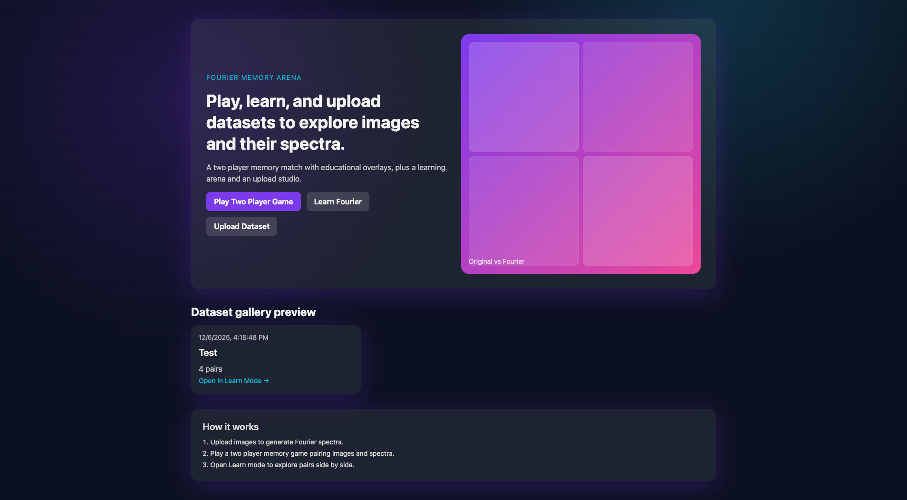
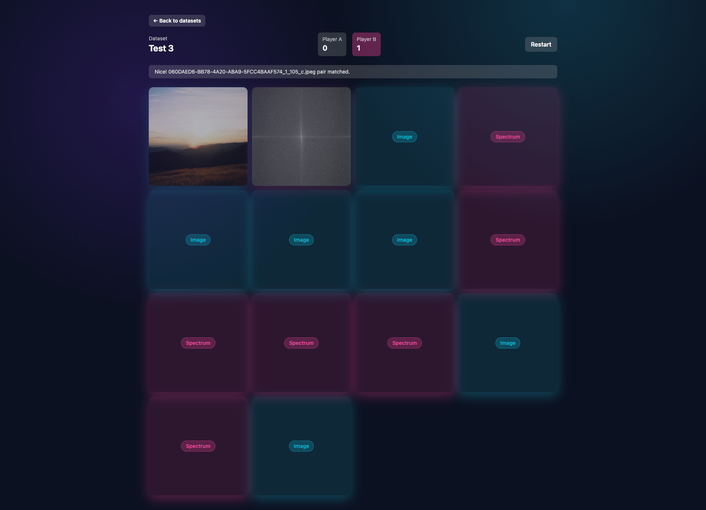
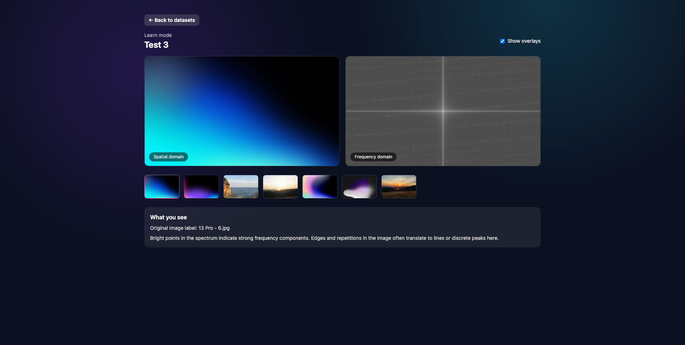
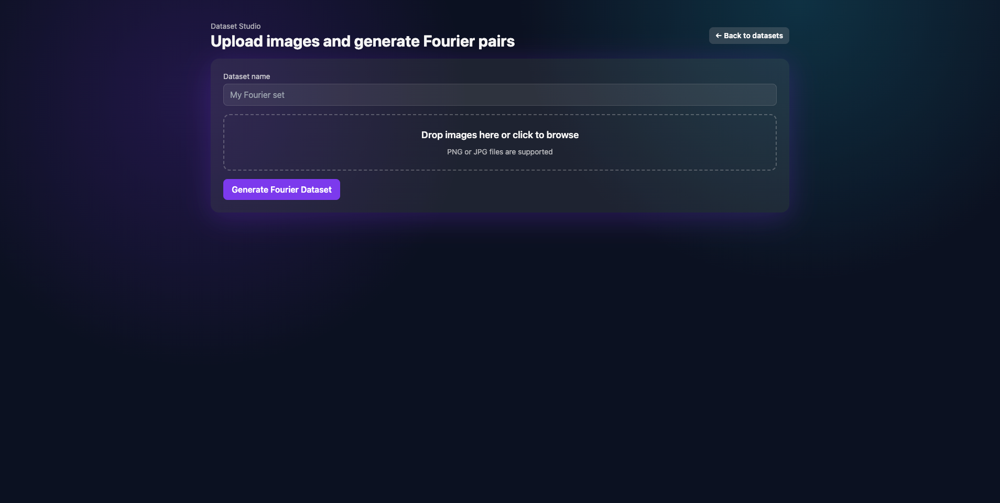

# **Fourier Memory**

A Two Player Visual Learning Game for Exploring the Frequency Domain

---

## **Overview**

Fourier Memory is an interactive, educational web application that turns the relationship between images and their Fourier spectra into a playful two player memory game.
Players flip cards, match original images with their computed Fourier transforms and learn, intuitively and visually, how patterns, edges and textures translate into frequency structures.

The platform also includes a Learn Mode for guided exploration and a Dataset Studio where users can upload their own images and automatically generate a custom Fourier dataset.

---

## **Project Goals**

### **1. Teach Fourier Transform Concepts Visually**

Instead of starting with formulas or theory, the app uses visual intuition.
Players _see_ how patterns in images become peaks, lines and structures in the spectrum.

### **2. Provide a Competitive, Fun Game Format**

Two players compete to match pairs correctly.
Correct matches display short explanations, reinforcing understanding through gameplay.

### **3. Support Custom Data Exploration**

Users can upload their own images and generate a new playable dataset in seconds.
Perfect for courses, creative experiments or quick intuition-building exercises.

### **4. Deliver a Clean, Modular Architecture**

The project is structured with a modern stack and clear separation of concerns, including:

- **Frontend:** Next.js (App Router), React, TypeScript, Tailwind
- **Backend:** Python FastAPI for dataset handling and Fourier processing
- **Storage:** File based dataset storage with metadata and generated spectra

---

## Screenshots

### Home



### Play (Game)



### Learn



### Dataset Gallery



---

## **Features**

### 🎮 **Two Player Memory Game**

- Match image cards with their corresponding Fourier spectrum cards
- Turn based gameplay
- Scoring system and match feedback
- Educational explanations after each successful match

### 📚 **Learn Mode**

- Side by side image and spectrum viewer
- Interactive overlays for orientation and frequency regions
- Explanations for edges, patterns, textures and noise
- Thumbnail navigation of all dataset items

### 📤 **Dataset Upload Studio**

- Upload individual images or ZIP archives
- Backend processes and generates Fourier spectra
- New datasets appear instantly in the game and Learn Mode
- Useful for custom experiments or coursework

### 🎨 **Colorful, Clear and Educational UI**

- Bright, friendly visuals
- Smooth animations for card flipping and transitions
- Simple explanations designed for non experts

---

## **How It Works**

1. **Upload or select a dataset**
2. **Start a two player session**
3. **Flip two cards each turn**
4. If image and spectrum match:

   - Score a point
   - View a short explanation

5. If not, next player takes the turn
6. Continue until all pairs are matched

Learn Mode provides deeper, guided exploration for students, educators or anyone curious about frequency analysis.

---

## **Use Cases**

- Teaching image processing or computer vision fundamentals
- Interactive demos for university courses
- Personal learning about FFT and frequency domain concepts
- Creative exploration of image patterns
- Fun two player challenge for visually minded people

---

## **Technology Stack**

### **Frontend**

- Next.js 14
- React
- TypeScript
- Tailwind CSS
- Client Components for interactive features
- Server Components for data fetching and SSR

### **Backend**

- Python FastAPI
- NumPy / Pillow for Fourier transform
- File based dataset storage

---

## **Project Structure**

```
frontend/
  app/
    ... Next.js routes
  components/
    ui/
    features/
  lib/
    api/
    types/
backend/
  app/
    domain/
    application/
    infrastructure/
    interfaces/
```

---

## **Roadmap**

- Multiplayer online mode (WebSockets)
- Per card hints and difficulty levels
- More overlays in Learn Mode
- Sound design and animations
- Public dataset gallery

---

## Install & Run

### Prerequisites

- Python 3.10+
- Node.js 18+ and npm
- (Optional) `python3-venv` package on Linux

### Backend (FastAPI) — `backend/`

Install:

```bash
cd backend
python -m venv .venv
source .venv/bin/activate   # Windows: .venv\Scripts\activate
pip install -r requirements.txt
```

Run:

```bash
uvicorn app.main:app --reload --app-dir .
```

- API base: `http://localhost:8000`
- Health: `GET /health`
- Datasets: `POST /datasets`, `GET /datasets`, `GET /datasets/{id}`
- Static files (original + Fourier images): served from `/static`

Config (env):

- `FOURIER_DATA_DIR` — dataset storage (default `backend/data`)
- `FOURIER_STATIC_URL_PREFIX` — static mount path (default `/static`)
- `FOURIER_DEBUG` — debug logging (default `true`)

Data layout:

```
backend/data/
  {dataset_id}/
    meta.json
    original/
      *.png|jpg
    fourier/
      *_fft.png
```

Tests:

```bash
cd backend
PYTHONPATH=. pytest
```

### Frontend (Next.js 14 + Tailwind) — `frontend/`

Install:

```bash
cd frontend
npm install
```

Configure backend URL (if not `http://localhost:8000`):

```bash
export NEXT_PUBLIC_API_BASE_URL="http://localhost:8000"
```

Dev server:

```bash
npm run dev
```

- Serves at `http://localhost:3000`

Build / start:

```bash
npm run build
npm start
```

Routes:

- `/` — landing
- `/datasets` — gallery
- `/game/[datasetId]` — two-player game
- `/learn/[datasetId]` — learn view
- `/upload` — dataset upload

### End-to-end (local)

1. Start backend: `cd backend && source .venv/bin/activate && uvicorn app.main:app --reload --app-dir .`
2. Start frontend: `cd frontend && npm run dev`
3. Open `http://localhost:3000/upload`, upload PNG/JPG files.
4. Play via `/game/{datasetId}` or learn via `/learn/{datasetId}`; list at `/datasets`.

### Troubleshooting

- 404 on datasets: backend not running or `NEXT_PUBLIC_API_BASE_URL` misconfigured.
- Missing images: check `backend/data/` and that `/static` is mounted.
- FFT errors: ensure `numpy` / `Pillow` installed in backend venv.

### Shortcuts / scripts

- Backend dev: `uvicorn app.main:app --reload --app-dir .`
- Backend tests: `PYTHONPATH=. pytest`
- Frontend dev: `npm run dev`
- Frontend build: `npm run build && npm start`

## **License**

MIT License unless specified otherwise.

---

## **Contributions**

Pull requests are welcome, especially for:

- new datasets
- UI improvements
- educational content
- bug fixes
